# DALVacationHome

DALVacationHome is a serverless vacation home management application built using multi-cloud deployment on AWS and GCP. The platform allows different types of users such as Guests, Registered Customers, and Property Agents to interact with the system. The application includes multiple modules such as authentication, virtual assistant, message passing, notifications, and data visualization, all built using modern cloud services.

## Table of Contents

- [Project Overview](#project-overview)
- [System Architecture](#system-architecture)
- [Features](#features)
- [Technology Stack](#technology-stack)
- [Setup Instructions](#setup-instructions)
- [Application Screenshots](#application-screenshots)

## Project Overview

**DALVacationHome** aims to provide a comprehensive solution for managing vacation homes with a focus on scalability, efficiency, and cloud-native technologies. The application is designed for three types of users:
- **Guests**: Can browse room availability and view feedback.
- **Registered Customers**: Can make reservations, communicate with agents, and leave feedback.
- **Property Agents**: Can manage room listings, handle customer concerns, and access analytical dashboards.

The project was developed as part of the CSCI 5410 course with a focus on serverless data processing.

## System Architecture

The application architecture is based on a serverless model, utilizing AWS and GCP services.

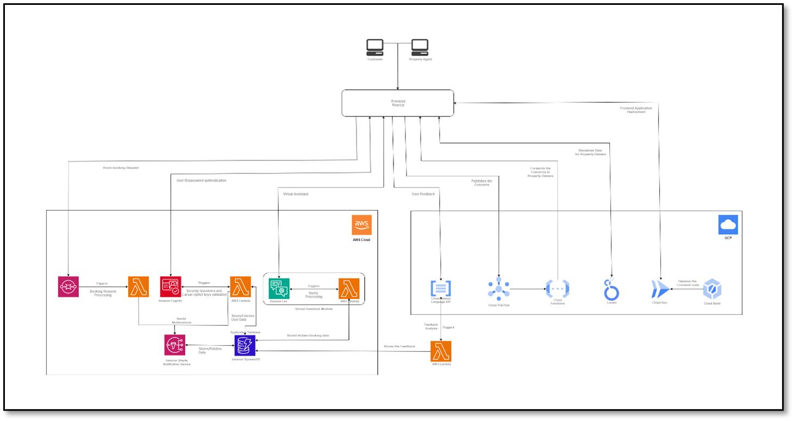

Key components:
- **Frontend**: Developed using React.js and deployed via GCP Cloud Run.
- **Backend**: AWS services such as Lambda, DynamoDB, SQS, SNS, and Google Cloud Pub/Sub for handling backend processing.
- **Authentication**: Multi-factor authentication using AWS Cognito, Lambda, and DynamoDB.
- **Messaging**: Asynchronous message passing between users and agents via AWS Lex and Google Cloud Pub/Sub.
- **Virtual Assistant**: A chatbot built using AWS Lex to assist users in navigation, booking, and customer concerns.
- **Data Analysis**: User feedback is analyzed using Google Natural Language API and presented in visual dashboards using Looker Studio.

## Features

- **Multi-factor Authentication**: Provides secure access using AWS Cognito with a multi-step authentication process (username/password, security questions, and Caesar cipher).
- **Virtual Assistant**: AWS Lex-powered chatbot for customer assistance.
- **Message Passing**: Facilitates communication between customers and property agents using Pub/Sub.
- **Notifications**: Uses AWS SNS for real-time notifications regarding bookings and user activities.
- **Data Visualization**: Analyzes customer feedback and presents insights using Looker Studio.

## Technology Stack

- **Frontend**: React.js, Tailwind CSS
- **Backend**: Node.js, AWS Lambda, GCP Cloud Functions
- **Cloud**: AWS, GCP
- **Databases**: DynamoDB (AWS), Firestore (GCP)
- **CI/CD**: Terraform, Google Cloud Build
- **Authentication**: AWS Cognito, Lambda
- **Messaging**: AWS SQS, Google Cloud Pub/Sub
- **Data Analysis**: Google Natural Language API, Looker Studio

## Setup Instructions

To set up the project locally, follow these steps:

1. **Clone the repository**:
   ```bash
   git clone https://github.com/khushpatel25/dalVacationHome
   cd dalVacationHome
   ```

2. **Install Dependencies**:
   ```bash
   npm install
   ```

3. **Backend Setup**:
   - Set up the AWS services (Cognito, Lambda, DynamoDB, SQS, SNS).
   - Configure GCP services (Cloud Functions, Pub/Sub, Firestore, Cloud Run).
   - Update the environment variables with the necessary credentials for AWS and GCP.

4. **Run the Application**:
   ```bash
   npm run dev
   ```

## Application Screenshots

Here are some screenshots of the DALVacationHome application:

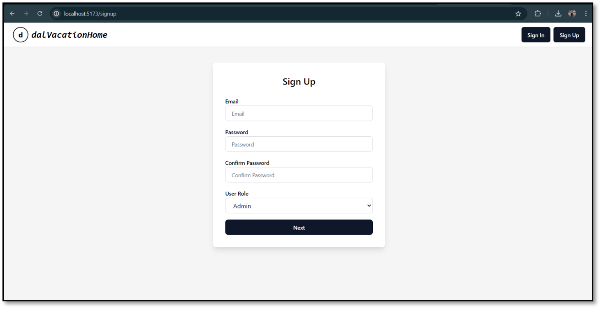
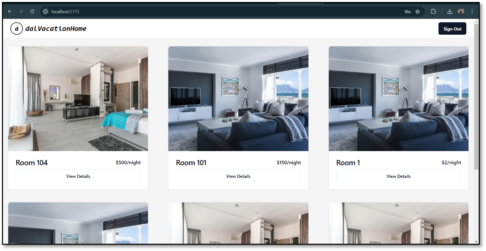
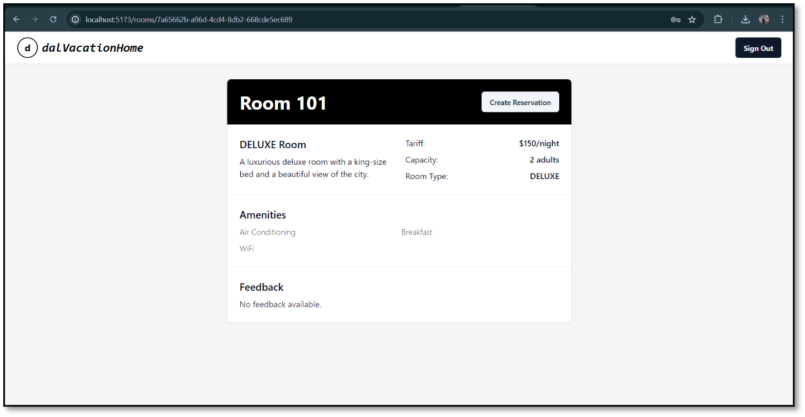
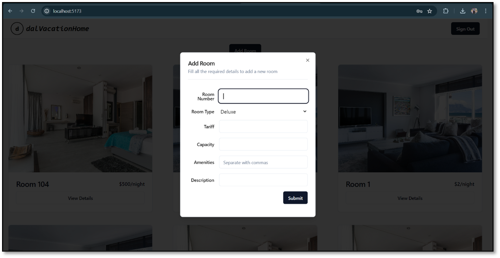
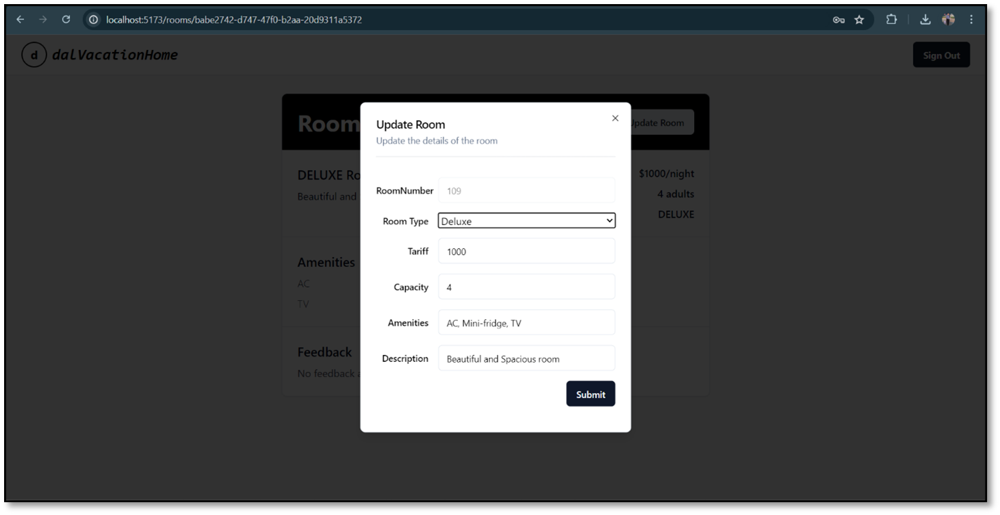
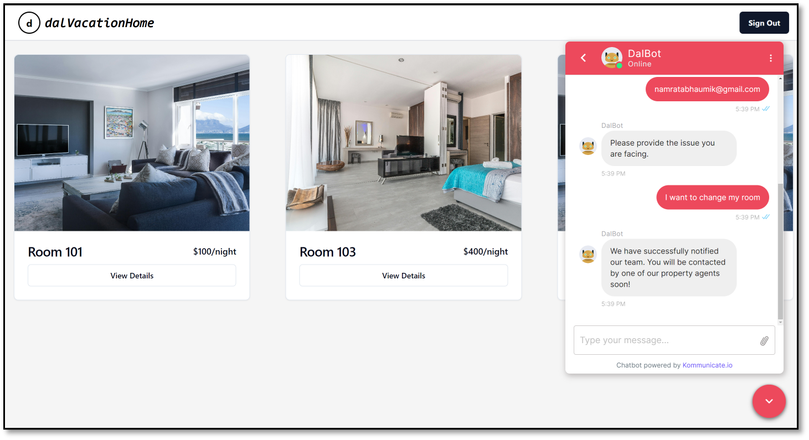
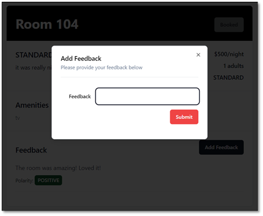
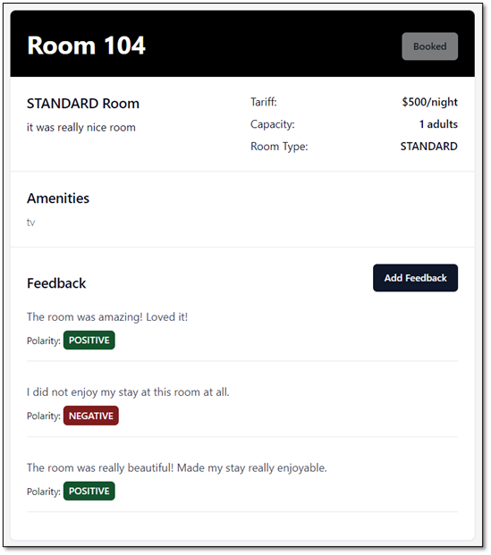
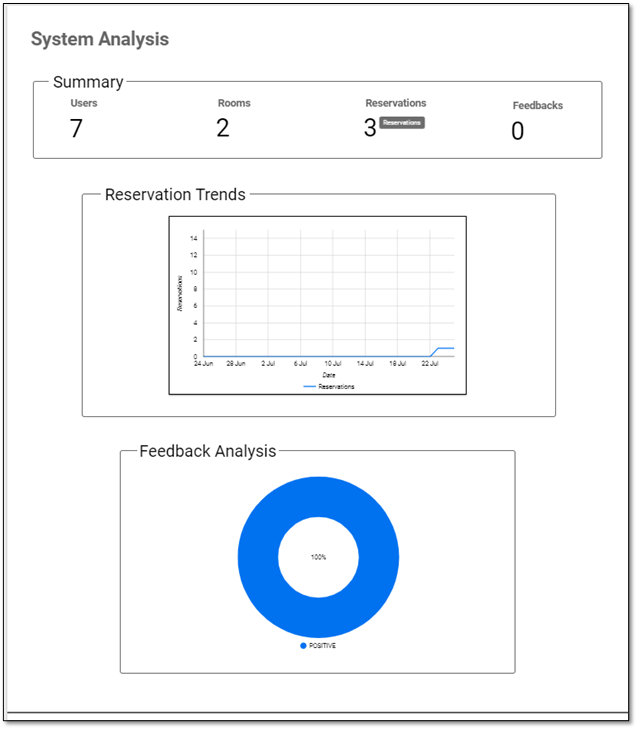
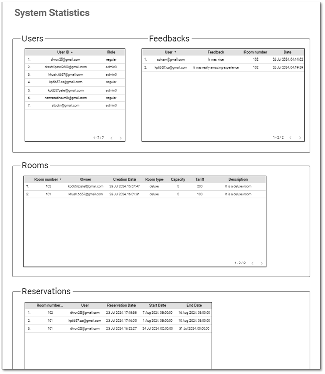

## License

This project is part of the CSCI 5410 course at Dalhousie University and follows academic guidelines.
